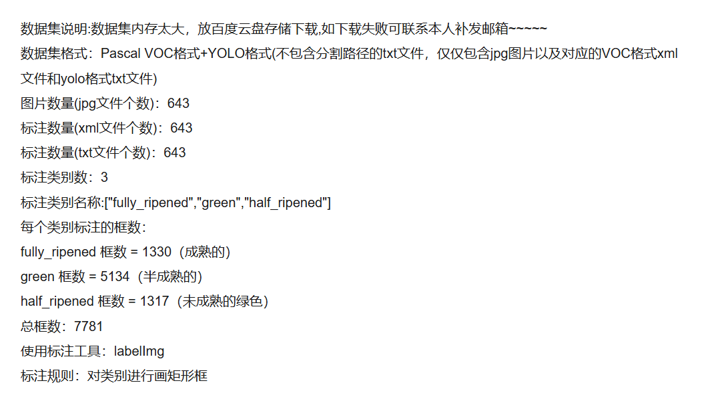
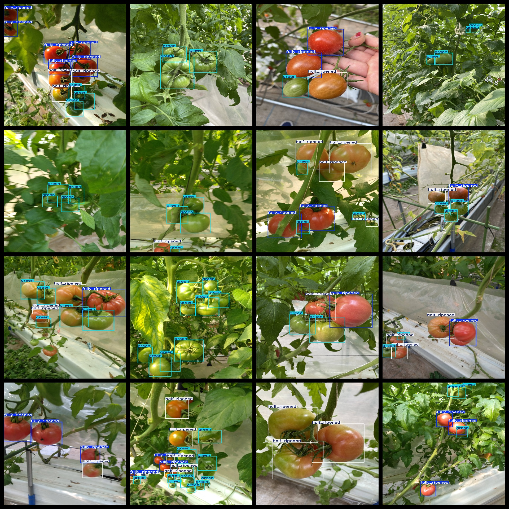

# [Object Detection Dataset] Tomato Tomato Ripeness Detection 640 images3-classVOC+YOLO format1

Dataset Description: ~

Dataset Format: Pascal VOC + YOLO (excluding the split-path txt file; only jpg images with corresponding VOC-format xml files and YOLO-format txt files)

Number of Images (jpg File Count): 643

Number of XML files: 643

Number of text files: 643

Number of annotated categories: 3

Categories: ["fully_ripened","green","half_ripened"]

Number of boxes labeled in each category:

fully_ripened frame count = 1330 (fully ripened)

Green Frames = 5134 (Semi-Mature)

half_ripened frame count = 1317 (unripened green)

Total frames: 7781

Use the labeling tool: labelImg

Rules for annotation: Draw a rectangle around the category.

Preserve the original meaning, format markers (【】『』「」<>[]), numbers, English words, and special characters as-is. Output ONLY the English translation, no explanations, no quotes.
## Images

---

Here is a pay link on Stripe (https://buy.stripe.com/3cs8yP7sY87d0vu9AB). Please contact me lonlonago@foxmail.com after funding $89, and I will send you a complete data files, thank you!

